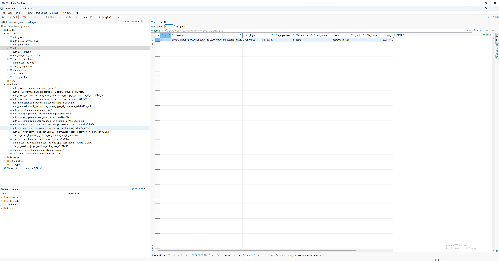

# Workshop about honeypots in Django
Workshop on the use of honeypots in the Django application, as part of Not The Hidden Knowledge - April 29, 2025

## Note: To be able to complete the tasks below, you must first lset up the environment and clone the application according to this instruction: https://github.com/beatazalewa/mysite/blob/main/README.md

### Step 1: Install DBeaver Community tool.

1. Download __DBeaver Community__ tool from this website: https://dbeaver.io/download/


2. Install tool using these settings:
- Double click __dbeaver-ce-25.0.3-x86_64-setup__ file.
- Click __Next__.


- On the __Licence Agreement__ window read the licence.
- Click __Next__.


- On the __Choose Users__ window choose for which users to install DBeaver Community.
- Click __Next__.


- On the __Choose Components__ window choose which features of DBeaver Community you want to install.
- Click __Next__.


- On the __Choose Install Location__ window choose the folder in which to install DBeaver Community.
- Click __Next__.


- On the __Choose Start Menu Folder__ window choose a Start Menu folder for the DBeaver Community shortcuts.
- Click __Install__.


- Click __Finish__.


### Step 2: Run the application and login to Admin panel
1. To test honeypot, we need to go access to admin portal. Before you create an administrator account, you must create tables to store your data. There is 19 unapplied migration(s). Your project may not work properly until you apply the migrations for app(s): admin, auth, contenttypes, polls, sessions.
Run this command below to migrate these tables:
```
python manage.py migrate
```


2. After migration, we can observe, that a new file is visible in our project. The name of this file is __db.sqlite3__.


3. Create a user for the app, using the command below. Provide a name, email address and password.
```
python manage.py createsuperuser
```


4. Now, you can open the database file, using for example __DBeaver Community__ tool.



To view the file: 
- Open __DBeaver Community__ tool.
- If you will be asking about installing sample database, click __Yes__.
- In the top left corner, click icon for __New Database connection__ (Ctrl + Shift + N).


- In the __Select your database__ window choose __SQLite__ and click __Next >__.


- In the __Generic JDBC Connection Settings__ click __Open..__.
- Choose from your project's folder __db.sqlite3__ file and the click __Open__.


- Click __Test Connection ...__.


- Click __OK__.
- Click __Finish__.


5. Run the application and try to login to admin portal:
```
python manage.py runserver
```


6. Switch to the browser, type http://127.0.0.1:8000/admin and provide username and password.
7. Click __Log in__.


8. Our admin panel currently looks like this:


9. Click __Users__ tab. Review the data.


### Step 3: Install django-admin-honeypot

__django-admin-honeypot__ is a fake Django admin login screen to log and notify admins of attempted unauthorized access. This app was inspired by discussion in and around Paul McMillan's security talk at DjangoCon 2011.
The project can be found on Github: https://github.com/dmpayton/django-admin-honeypot.
Documentation: http://django-admin-honeypot.readthedocs.io

1. Install __django-admin-honeypot__ from PyPI:

```
pip install django-admin-honeypot-updated-2021
```


2. Add __admin_honeypot__ to __INSTALLED_APPS__ section in __mysite\settings.py__ file.


3. Update your __urls.py__ file.

    __Note__: You can replace __newsroom__ in the url below with your own url prefix.
```
urlpatterns = [
    ...
    path('admin/', include('admin_honeypot.urls', namespace='admin_honeypot')),
    path('newsroom/', admin.site.urls),
    ...
]
```


4. Run command below to add new table __admin_honeypot>> to migrations:
```
python manage.py makemigrations
```
5. Deploy changes to database using command below:

```
python manage.py migrate
```


6. Check, if you see the new table __admin_honeypot__ in your database in DBeaver tool.


### Step 4: Testing honeypots

1. Run the application again.
```
python manage.py runserver
```


2. Logout from the admin panel and close the browser. If needed, clear the browsing data.

   Try to login again using created previously user.

   Are you able to do this? Why?


3. Now try to login using this URL: http://127.0.0.1:8000/newsroom

   Are you able to do this? Why?


4. Click link __Login attempts__ under __ADMIN_HONEYPOT__ section. What do you see?


5. Open a new tab and try to login to fake __Admin portal__ (http://127.0.0.1:8000/admin) using different accounts, to simulate attack.


6. Switch to __Newsroom__ and check again login attempts. Check __SESSION__ column.


7. Open new browser in new private window and open again __fake Admin portal__. Try to login few times:


8. Switch to __Newsroom__ and check again login attempts. Check __SEESSION__ column.


9. Check django_session table in a database.


### Step 5: Challenge
A honeypot is typically used in web applications to detect and prevent automated bots or malicious activity. In the context of Django models, you can add a __honeypot__ field to your forms or models that is not meant to be filled by legitimate users. If the field is filled, it indicates suspicious activity. Try to implement a honeypot mechanism for the __Question__ and __Choice__ models.

__Polls app__:
1. Go to __Newsroom - admin portal__ and add few questions and choices by clicking __Questions__ link under __POLLS__ section.


2. Click the __Choices__ link to view, that choices where automatically added.


3. Switch to __DBeaver__ and review tables __polls_question__ and __polls_choice__.


